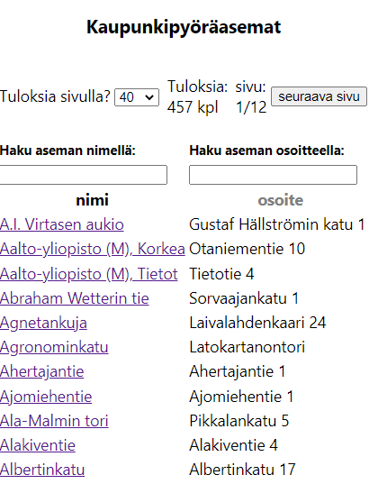
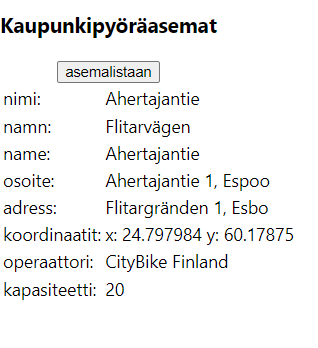

README.md
=
Tekijä: Heli Kleemola

Pvm: 6.3.2023
Muutettu 27.3.2023: Lisätty backendiin matkojen hallintaan liittyvät tiedostot (journeyController, journeyModel ja journeyRoutes) ja lisäyksiä myös asemien luomiseen ja poistamiseen liittyvissä tiedostoissa (stationController, stationRoutes). Myös pieniä muutoksia server.js-tiedostoon. Backend testattu Insomnialla toimivaksi. Frontendissä nämä muutokset eivät näy vielä mitenkään, joten tätä README.md-tiedostoa ei ole muuten päivitetty.

# Kaupunkipyöräasemien hallintaohjelma

Tämä on yksinkertainen kaupunkipyöräasemasovellus, joka näyttää Helsingin ja Espoon kaupunkipyöräasemat listana.

Käyttäjä voi valita listasta pyöräaseman ja näyttää sen tiedot.

Tätä sovellusta kehitetään Solita Dev Academyn ennakkotehtävän määrittelyjen mukaan. Toteutus on vielä alkuvaiheessa.

## Tekniikat

- MongoDB Atlas: pilvessä toimiva tietokantapalvelu, jonka ilmaisessa versiossa on rajoitettu määrä tallennuskapasiteettia

- Node.js: sovelluksen backendin toteutusympäristö

- Express: Node.js-pohjainen Web-sovelluskehys backendin rakentamiseen

- Concurrently: Node.js-pohjainen työkalu, jonka avulla voi suorittaa yhdessä terminaalissa samanaikaisesti useamman komennon

- Nodemon: kehitystyökalu, joka seuraa React-sovelluksen tiedostoja ja käynnistää sovelluksen uudelleen, kun jotakin tiedostoa on muutettu

- REST: tapa rakentaa ja toteuttaa API-rajapintoja web-sovelluksissa

- NPM-paketit (Node Package Manager):

  - colors: sisältää React-komponentteja, joiden avulla voi  käyttää erilaisia väriteemoja React-sovelluksissa
  - dotenv: ympäristömuuttujien käyttö React-sovelluksissa
  - Axios: käsittelee HTTP-pyyntöjä selaimessa ja Node.js:ssa
  
- React-paketit:

  - React: JavaScript-kirjasto käyttöliittymän rakentamiseen
  - Mongoose-kirjasto MongoDB-tietokannan käyttämiseen   
  - ReactDOM-kirjasto selaimessa näkyvien näkymien luomiseen ja hallintaan
  - React Redux -kirjasto sovelluksen tilojen hallintaan (sovelluksessa tarvittavien muuttujien hallintaan)
  - React Router DOM -kirjasto React-sovelluksen reititysten (routing) hallintaan
  - React Scripts -kirjasto, joka on osa Reactin kehitysympäristöä

## Käytetyt ohjelmat:

- Visual Studio Code: koodin kirjoittamiseen

- Insomnia: backendin toimivuuden testaukseen

- Google Chrome -selain + laajennus: React Developer Tools: sovelluksen käyttämiseen ja testaamiseen

## Mitä seuraavaksi?

Seuraavaksi lisään sovellukseen kaupunkipyörämatkojen hallintaa.

## Asennus- ja käyttöohje
- oletan, että olet saanut minulta .env-tiedoston (jos sinulla ei ole tätä tiedostoa, niin ohjelma ei saa yhteyttä tietokantaan)
- oletan, että koneeseesi on asennettuna React ja Node.js
- lataa omalle koneellesi alla olevasta github-linkistä kaikki tiedostot (vihreän Code-näppäimen alta: Download ZIP)

    https://github.com/hkleemola/citybikeapp
- aja juurikansiossa (eli kansio, jossa on esim. alikansiot: frontend ja backend):

      npm i
- aja frontend-kansiossa:

      npm i
- siirrä minulta saamasi .env tiedosto juurikansioon
- voit käynnistää sovelluksen:

  * JOKO yhdellä komennolla juurikansiossa:

        npm run dev
  * TAI backendin ja frontendin erikseen (joskus ei jostain syystä käynnisty yhdellä?):

    * backendin juurikansiosta:

          npm run server
    * frontendin frontend-kansiosta

          npm run start
- nyt pitäisi selaimessa näkyä sovelluksen otsikkorivit ja asemalistaus

- listasta voit valita jonkin aseman sen nimeä klikkaamalla, jolloin näytetään aseman tiedot
- aseman tiedot -näkymästä voi palata takaisin asemalistaan painamalla: asemalistaan-näppäintä

## Kuvia sovelluksesta:

|  Asemalistanäkymästä: | Aseman tiedot -näkymästä: |
|---|---|
|  |  |

